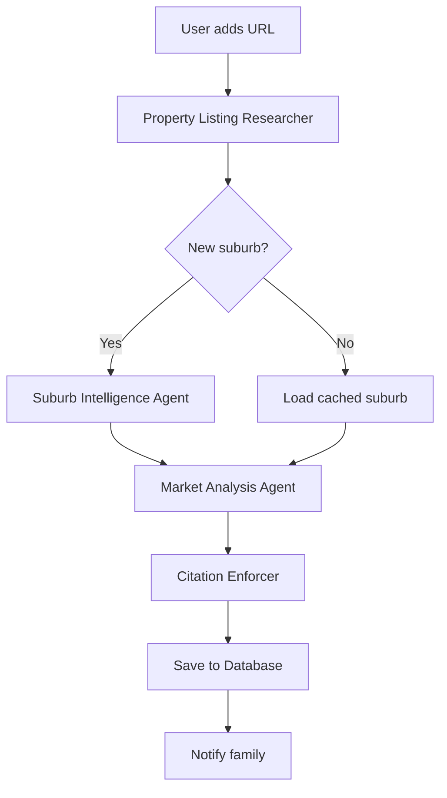
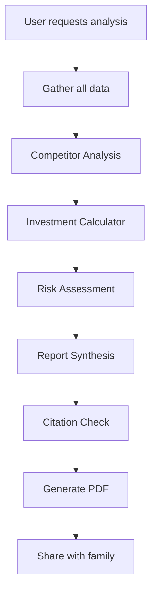

# 🤖 AI Agent Specifications

## Overview

The House Hunt platform uses specialized AI agents to automate research, data gathering, and analysis. Each agent has specific capabilities and follows strict protocols for data accuracy and citation.

## Agent Architecture

```
┌─────────────────────────────────────┐
│         User Interface              │
└────────────┬────────────────────────┘
             │
┌────────────▼────────────────────────┐
│      Agent Orchestrator             │
│   (Manages agent workflows)         │
└────────────┬────────────────────────┘
             │
┌────────────▼────────────────────────┐
│        Agent Pool                   │
├─────────────────────────────────────┤
│ • Property Listing Researcher       │
│ • Suburb Intelligence               │
│ • Market Analysis                   │
│ • Citation Enforcer                 │
│ • Competitor Analysis               │
│ • Report Synthesis                  │
└─────────────────────────────────────┘
```

## Core Agents

### 1. Property Listing Researcher

**Purpose**: Automated extraction of property details from real estate listings

**Capabilities**:
- Web scraping from Domain.com.au and RealEstate.com.au
- Dynamic content handling with Puppeteer
- Image downloading and organization
- Data structure normalization
- Change detection and updates

**Input**:
```typescript
{
  url: string;
  depth?: 'basic' | 'detailed' | 'comprehensive';
}
```

**Output**:
```typescript
{
  address: string;
  price: {
    display: string;
    min?: number;
    max?: number;
  };
  details: {
    bedrooms: number;
    bathrooms: number;
    parking: number;
    landSize?: number;
    propertyType: string;
  };
  description: string;
  features: string[];
  images: {
    url: string;
    caption?: string;
    type: 'exterior' | 'interior' | 'floorplan';
  }[];
  agent: {
    name: string;
    agency: string;
    phone?: string;
    email?: string;
  };
  metadata: {
    listingId: string;
    listedDate: Date;
    lastUpdated: Date;
    source: string;
  };
}
```

**Implementation**:
```typescript
class PropertyListingResearcher {
  async research(url: string): Promise<PropertyData> {
    // 1. Validate URL
    // 2. Launch headless browser
    // 3. Navigate and wait for content
    // 4. Extract structured data
    // 5. Download images
    // 6. Validate and return
  }
}
```

### 2. Suburb Intelligence Agent

**Purpose**: Build comprehensive, reusable suburb profiles

**Data Sources**:
- Australian Bureau of Statistics (ABS)
- State crime statistics
- Education department APIs
- Council planning portals
- Public transport authorities
- OpenStreetMap/Google Places

**Capabilities**:
- Multi-source data aggregation
- Historical trend analysis
- Geospatial calculations
- School catchment mapping
- Amenity scoring

**Input**:
```typescript
{
  suburb: string;
  state: string;
  dataPoints?: string[]; // Optional specific data requests
}
```

**Output**:
```typescript
{
  demographics: {
    population: number;
    medianAge: number;
    medianIncome: number;
    familyComposition: object;
    growth: {
      yearly: number;
      fiveYear: number;
    };
  };
  education: {
    schools: School[];
    catchments: CatchmentZone[];
    rankings: object;
  };
  safety: {
    crimeRates: CrimeStats;
    trend: 'improving' | 'stable' | 'declining';
    emergencyServices: Location[];
  };
  transport: {
    publicTransport: Station[];
    commuteTime: {
      cbd: number;
      airport: number;
    };
    accessibility: number; // 0-100 score
  };
  amenities: {
    shopping: Place[];
    healthcare: Place[];
    recreation: Place[];
    dining: Place[];
  };
  market: {
    medianPrice: {
      house: number;
      unit: number;
    };
    growth: GrowthMetrics;
    rentalYield: number;
    daysOnMarket: number;
  };
  risks: {
    flood: 'low' | 'medium' | 'high';
    bushfire: 'low' | 'medium' | 'high';
    development: string[];
  };
  sources: Citation[];
  lastUpdated: Date;
}
```

### 3. Market Analysis Agent

**Purpose**: Analyze property pricing and market conditions

**Capabilities**:
- Recent sales data collection
- Price trend analysis
- Seasonal pattern detection
- Comparable property identification
- Market heat mapping

**Algorithm**:
```typescript
class MarketAnalyzer {
  analyzePrice(property: Property): PriceAnalysis {
    // 1. Find comparable sales
    const comparables = this.findComparables({
      suburb: property.suburb,
      bedrooms: property.bedrooms ± 1,
      propertyType: property.type,
      recency: 6 // months
    });
    
    // 2. Calculate price metrics
    const medianPrice = this.calculateMedian(comparables);
    const pricePerSqm = this.calculatePricePerSqm(comparables);
    
    // 3. Adjust for features
    const adjustedPrice = this.adjustForFeatures(
      medianPrice,
      property.features
    );
    
    // 4. Generate assessment
    return {
      estimatedValue: adjustedPrice,
      askingPrice: property.price,
      difference: property.price - adjustedPrice,
      percentDifference: ((property.price - adjustedPrice) / adjustedPrice) * 100,
      assessment: this.getAssessment(percentDifference),
      confidence: this.calculateConfidence(comparables.length),
      comparables: comparables
    };
  }
}
```

### 4. Citation Quality Enforcer

**Purpose**: Ensure all data has proper citations and sources

**Responsibilities**:
- Add citations to all facts
- Verify source credibility
- Track data freshness
- Maintain reference lists
- Flag uncited claims

**Citation Format**:
```typescript
{
  fact: string;
  source: {
    name: string;
    url: string;
    accessDate: Date;
    reliability: 'official' | 'verified' | 'unverified';
  };
  confidence: number; // 0-100
}
```

**Enforcement Rules**:
1. Every numerical claim must have a source
2. Sources must be less than 90 days old
3. Government sources preferred over commercial
4. Multiple sources increase confidence
5. Conflicting data requires human review

### 5. Competitor Analysis Agent

**Purpose**: Compare multiple properties for decision making

**Capabilities**:
- Feature-by-feature comparison
- Value scoring algorithms
- Strength/weakness identification
- Investment potential ranking

**Comparison Matrix**:
```typescript
{
  properties: Property[];
  comparison: {
    features: FeatureComparison[];
    pricing: PriceComparison;
    location: LocationComparison;
    investment: InvestmentComparison;
  };
  rankings: {
    overall: PropertyRank[];
    value: PropertyRank[];
    investment: PropertyRank[];
    lifestyle: PropertyRank[];
  };
  recommendations: string[];
}
```

### 6. Report Synthesis Engine

**Purpose**: Generate comprehensive reports from all research

**Report Types**:
1. **Quick Summary** - 1-page overview
2. **Family Report** - Detailed with pros/cons
3. **Bank Report** - Professional with financials
4. **Inspection Checklist** - For property visits

**Sections**:
- Executive Summary
- Property Details
- Market Analysis
- Suburb Profile
- Investment Metrics
- Risk Assessment
- Comparable Sales
- Recommendations
- Appendices

## Agent Workflows

### Property Addition Workflow



### Deep Analysis Workflow



## Agent Configuration

### Environment Variables

```env
# Scraping
PUPPETEER_EXECUTABLE_PATH=/usr/bin/chromium
USER_AGENT="Mozilla/5.0..."

# APIs
ABS_API_KEY=...
DOMAIN_API_KEY=...
GOOGLE_PLACES_KEY=...

# Limits
MAX_SCRAPE_RETRIES=3
SCRAPE_TIMEOUT=30000
RATE_LIMIT_DELAY=2000

# AI
OPENAI_API_KEY=...
OPENAI_MODEL=gpt-4
```

### Rate Limiting

```typescript
const rateLimits = {
  'domain.com.au': {
    requests: 60,
    window: 60000, // 1 minute
    delay: 1000
  },
  'realestate.com.au': {
    requests: 100,
    window: 60000,
    delay: 600
  },
  'abs.gov.au': {
    requests: 1000,
    window: 3600000, // 1 hour
    delay: 100
  }
};
```

## Quality Assurance

### Data Validation

Each agent must validate its output:

```typescript
interface ValidationRule {
  field: string;
  type: 'required' | 'optional';
  validator: (value: any) => boolean;
  errorMessage: string;
}

const propertyValidation: ValidationRule[] = [
  {
    field: 'address',
    type: 'required',
    validator: (v) => v && v.length > 0,
    errorMessage: 'Address is required'
  },
  {
    field: 'price',
    type: 'required',
    validator: (v) => v > 0 || v.min > 0,
    errorMessage: 'Valid price required'
  }
];
```

### Error Handling

```typescript
class AgentError extends Error {
  constructor(
    message: string,
    public agent: string,
    public retryable: boolean,
    public details?: any
  ) {
    super(message);
  }
}

// Usage
try {
  const data = await scraper.extract(url);
} catch (error) {
  if (error.retryable) {
    await retry(3, () => scraper.extract(url));
  } else {
    await notifyUser(error);
  }
}
```

## Monitoring & Metrics

### Agent Performance Metrics

```typescript
interface AgentMetrics {
  agent: string;
  successRate: number;
  averageExecutionTime: number;
  errorsToday: number;
  dataPointsCollected: number;
  lastRun: Date;
}
```

### Logging

```typescript
logger.info({
  agent: 'PropertyListingResearcher',
  action: 'scrape',
  url: propertyUrl,
  duration: 1234,
  dataPoints: 15,
  success: true
});
```

## Testing

### Unit Tests

```typescript
describe('PropertyListingResearcher', () => {
  it('should extract price correctly', async () => {
    const html = '<span class="price">$750,000</span>';
    const price = extractor.extractPrice(html);
    expect(price).toBe(750000);
  });
});
```

### Integration Tests

```typescript
describe('Agent Integration', () => {
  it('should handle full property workflow', async () => {
    const url = 'https://domain.com.au/test-property';
    const property = await orchestrator.processProperty(url);
    
    expect(property).toHaveProperty('address');
    expect(property).toHaveProperty('suburb.profile');
    expect(property).toHaveProperty('analysis');
    expect(property.citations.length).toBeGreaterThan(0);
  });
});
```

## Best Practices

1. **Always cite sources** - No uncited facts
2. **Handle failures gracefully** - Retry with backoff
3. **Cache aggressively** - Reduce API calls
4. **Validate everything** - Don't trust scraped data
5. **Log comprehensively** - For debugging
6. **Update regularly** - Keep data fresh
7. **Respect rate limits** - Avoid getting blocked
8. **Test thoroughly** - Unit and integration
9. **Monitor performance** - Track metrics
10. **Document changes** - Maintain changelog