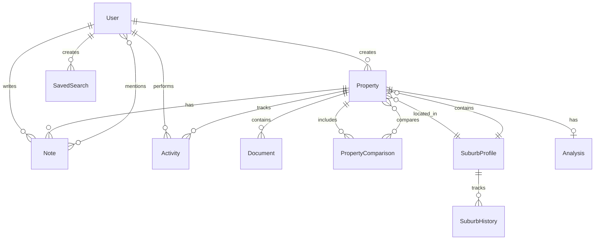

# 📊 Database Schema Documentation

## Overview

The House Hunt platform uses PostgreSQL with Prisma ORM for type-safe database access. The schema is designed for collaborative property research with real-time updates.

## Entity Relationship Diagram



## Core Models

### User

Represents family members with access to the platform.

```prisma
model User {
  id            String    @id @default(cuid())
  email         String    @unique
  name          String
  image         String?
  role          UserRole  @default(VIEWER)
  
  // Relations
  properties    Property[]
  notes         Note[]
  activities    Activity[]
  savedSearches SavedSearch[]
  mentions      Note[]     @relation("UserMentions")
  
  // Timestamps
  createdAt     DateTime  @default(now())
  updatedAt     DateTime  @updatedAt
  lastActive    DateTime?
  
  @@index([email])
}

enum UserRole {
  ADMIN     // Full access, can manage users
  EDITOR    // Can add/edit properties and notes
  VIEWER    // Read-only access
}
```

### Property

Core entity representing a real estate listing.

```prisma
model Property {
  id             String    @id @default(cuid())
  
  // Basic Info
  url            String    @unique
  address        String
  suburb         String
  state          String
  postcode       String
  
  // Price
  priceDisplay   String    // "$750,000" or "$700k-$800k"
  priceMin       Int?      // 700000
  priceMax       Int?      // 800000
  
  // Details
  bedrooms       Int
  bathrooms      Int
  parking        Int
  landSize       Int?      // in sqm
  propertyType   PropertyType
  
  // Status
  status         PropertyStatus @default(RESEARCHING)
  statusHistory  Json      // Array of status changes
  
  // Content
  description    String    @db.Text
  features       String[]
  images         Json      // Array of image objects
  scrapedData    Json      // Raw data from scraping
  
  // Agent
  agentName      String?
  agentAgency    String?
  agentPhone     String?
  agentEmail     String?
  
  // Metadata
  listingId      String?
  listedDate     DateTime?
  daysOnMarket   Int?
  
  // Relations
  createdBy      User      @relation(fields: [createdById], references: [id])
  createdById    String
  
  suburb         SuburbProfile @relation(fields: [suburbId], references: [id])
  suburbId       String
  
  notes          Note[]
  activities     Activity[]
  documents      Document[]
  analysis       Analysis?
  comparisons    PropertyComparison[]
  
  // Timestamps
  createdAt      DateTime  @default(now())
  updatedAt      DateTime  @updatedAt
  lastScraped    DateTime?
  
  @@index([suburb])
  @@index([status])
  @@index([createdAt])
  @@index([priceMin, priceMax])
}

enum PropertyType {
  HOUSE
  APARTMENT
  TOWNHOUSE
  VILLA
  LAND
  ACREAGE
  OTHER
}

enum PropertyStatus {
  RESEARCHING       // Initial investigation
  INTERESTED        // Marked for consideration
  VIEWING_SCHEDULED // Inspection booked
  VIEWED           // Property inspected
  OFFER_PENDING    // Offer submitted
  REJECTED         // Not proceeding
  PURCHASED        // Successfully purchased
  ARCHIVED         // No longer active
}
```

### SuburbProfile

Reusable suburb intelligence data.

```prisma
model SuburbProfile {
  id            String    @id @default(cuid())
  
  // Location
  name          String
  state         String
  postcode      String
  latitude      Float
  longitude     Float
  
  // Demographics
  population    Int?
  medianAge     Float?
  medianIncome  Int?
  demographics  Json      // Detailed breakdown
  
  // Education
  schools       Json      // Array of schools
  catchments    Json      // School zones
  
  // Safety
  crimeStats    Json      // Crime categories and rates
  crimeTrend    String?   // improving/stable/declining
  
  // Transport
  transport     Json      // Public transport options
  commuteTime   Json      // Times to key locations
  
  // Amenities
  amenities     Json      // Shopping, healthcare, etc.
  
  // Market
  medianHousePrice  Int?
  medianUnitPrice   Int?
  rentalYield       Float?
  growthRate        Float?
  daysOnMarket      Int?
  marketData        Json    // Detailed market stats
  
  // Risks
  floodRisk     RiskLevel?
  bushfireRisk  RiskLevel?
  developments  Json?     // Planned developments
  
  // Relations
  properties    Property[]
  history       SuburbHistory[]
  
  // Metadata
  sources       Json      // Data sources and citations
  lastUpdated   DateTime
  createdAt     DateTime  @default(now())
  
  @@unique([name, state, postcode])
  @@index([name])
}

enum RiskLevel {
  LOW
  MEDIUM
  HIGH
}
```

### Note

Collaborative notes and comments on properties.

```prisma
model Note {
  id          String    @id @default(cuid())
  
  content     String    @db.Text
  type        NoteType  @default(GENERAL)
  
  // Relations
  property    Property  @relation(fields: [propertyId], references: [id], onDelete: Cascade)
  propertyId  String
  
  author      User      @relation(fields: [authorId], references: [id])
  authorId    String
  
  mentions    User[]    @relation("UserMentions")
  
  // Threading
  parentId    String?
  parent      Note?     @relation("NoteReplies", fields: [parentId], references: [id])
  replies     Note[]    @relation("NoteReplies")
  
  // Metadata
  edited      Boolean   @default(false)
  editedAt    DateTime?
  createdAt   DateTime  @default(now())
  updatedAt   DateTime  @updatedAt
  
  @@index([propertyId])
  @@index([authorId])
  @@index([createdAt])
}

enum NoteType {
  GENERAL
  PRO
  CON
  QUESTION
  INSPECTION
  IMPORTANT
}
```

### Analysis

Generated analysis and reports for properties.

```prisma
model Analysis {
  id            String    @id @default(cuid())
  
  // Relations
  property      Property  @relation(fields: [propertyId], references: [id], onDelete: Cascade)
  propertyId    String    @unique
  
  // Pricing Analysis
  estimatedValue    Int?
  overpricing       Float?   // Percentage
  priceAssessment   String?  // under/fair/over
  confidence        Float?   // 0-100
  
  // Comparables
  comparables       Json     // Array of comparable sales
  
  // Investment Metrics
  rentalYield       Float?
  capitalGrowth     Float?
  cashFlow          Json?
  
  // Scores
  valueScore        Float?   // 0-100
  investmentScore   Float?   // 0-100
  locationScore     Float?   // 0-100
  
  // Risk Assessment
  risks             Json     // Array of identified risks
  
  // Generated Reports
  summary           String?  @db.Text
  detailedReport    Json?
  
  // Metadata
  generatedAt       DateTime @default(now())
  updatedAt         DateTime @updatedAt
}
```

### Document

Files and attachments related to properties.

```prisma
model Document {
  id          String    @id @default(cuid())
  
  name        String
  type        DocumentType
  url         String
  size        Int       // in bytes
  mimeType    String
  
  // Relations
  property    Property  @relation(fields: [propertyId], references: [id], onDelete: Cascade)
  propertyId  String
  
  uploadedBy  User      @relation(fields: [uploadedById], references: [id])
  uploadedById String
  
  // Metadata
  metadata    Json?     // OCR text, extracted data
  createdAt   DateTime  @default(now())
  
  @@index([propertyId])
}

enum DocumentType {
  CONTRACT
  INSPECTION_REPORT
  STRATA_REPORT
  PEST_REPORT
  BUILDING_REPORT
  FLOORPLAN
  OTHER
}
```

### Activity

Audit trail of all user actions.

```prisma
model Activity {
  id          String    @id @default(cuid())
  
  type        ActivityType
  action      String    // Description of action
  metadata    Json?     // Additional context
  
  // Relations
  user        User      @relation(fields: [userId], references: [id])
  userId      String
  
  property    Property? @relation(fields: [propertyId], references: [id], onDelete: Cascade)
  propertyId  String?
  
  // Timestamp
  createdAt   DateTime  @default(now())
  
  @@index([userId])
  @@index([propertyId])
  @@index([createdAt])
}

enum ActivityType {
  PROPERTY_ADDED
  PROPERTY_UPDATED
  STATUS_CHANGED
  NOTE_ADDED
  NOTE_EDITED
  DOCUMENT_UPLOADED
  VIEWING_SCHEDULED
  ANALYSIS_GENERATED
  REPORT_EXPORTED
  USER_MENTIONED
}
```

### PropertyComparison

Saved property comparisons.

```prisma
model PropertyComparison {
  id          String    @id @default(cuid())
  
  name        String
  notes       String?   @db.Text
  
  // Relations
  properties  Property[]
  
  createdBy   User      @relation(fields: [createdById], references: [id])
  createdById String
  
  // Analysis
  weights     Json?     // Feature importance weights
  rankings    Json?     // Computed rankings
  
  // Timestamps
  createdAt   DateTime  @default(now())
  updatedAt   DateTime  @updatedAt
  
  @@index([createdById])
}
```

### SavedSearch

User's saved search criteria.

```prisma
model SavedSearch {
  id          String    @id @default(cuid())
  
  name        String
  criteria    Json      // Search parameters
  
  // Notifications
  emailAlert  Boolean   @default(false)
  pushAlert   Boolean   @default(false)
  
  // Relations
  user        User      @relation(fields: [userId], references: [id])
  userId      String
  
  // Metadata
  lastRun     DateTime?
  resultCount Int?
  
  createdAt   DateTime  @default(now())
  updatedAt   DateTime  @updatedAt
  
  @@index([userId])
}
```

### SuburbHistory

Historical tracking of suburb data changes.

```prisma
model SuburbHistory {
  id            String    @id @default(cuid())
  
  // Relations
  suburb        SuburbProfile @relation(fields: [suburbId], references: [id])
  suburbId      String
  
  // Snapshot
  data          Json      // Complete suburb data at this point
  changes       Json?     // What changed from previous
  
  // Timestamp
  recordedAt    DateTime  @default(now())
  
  @@index([suburbId])
  @@index([recordedAt])
}
```

## Database Indexes

Optimized indexes for common queries:

```prisma
// Property searches
@@index([suburb, status])
@@index([priceMin, priceMax, bedrooms])
@@index([createdAt DESC])

// Note queries
@@index([propertyId, createdAt DESC])

// Activity timeline
@@index([userId, createdAt DESC])
@@index([propertyId, createdAt DESC])

// Suburb lookups
@@index([name, state])
```

## Migrations

### Initial Schema

```sql
-- CreateEnum
CREATE TYPE "UserRole" AS ENUM ('ADMIN', 'EDITOR', 'VIEWER');
CREATE TYPE "PropertyType" AS ENUM ('HOUSE', 'APARTMENT', 'TOWNHOUSE', 'VILLA', 'LAND', 'ACREAGE', 'OTHER');
CREATE TYPE "PropertyStatus" AS ENUM ('RESEARCHING', 'INTERESTED', 'VIEWING_SCHEDULED', 'VIEWED', 'OFFER_PENDING', 'REJECTED', 'PURCHASED', 'ARCHIVED');
-- ... more enums

-- CreateTable
CREATE TABLE "User" (
    "id" TEXT NOT NULL,
    "email" TEXT NOT NULL,
    "name" TEXT NOT NULL,
    -- ... more fields
    CONSTRAINT "User_pkey" PRIMARY KEY ("id")
);

-- ... more tables

-- CreateIndex
CREATE UNIQUE INDEX "User_email_key" ON "User"("email");
-- ... more indexes
```

## Query Examples

### Find Properties in Suburb

```typescript
const properties = await prisma.property.findMany({
  where: {
    suburb: 'Gawler East',
    status: 'INTERESTED',
    priceMin: {
      gte: 600000
    },
    priceMax: {
      lte: 800000
    }
  },
  include: {
    notes: {
      orderBy: {
        createdAt: 'desc'
      },
      take: 5
    },
    analysis: true
  }
});
```

### Get Suburb with Properties

```typescript
const suburb = await prisma.suburbProfile.findUnique({
  where: {
    name_state_postcode: {
      name: 'Gawler East',
      state: 'SA',
      postcode: '5118'
    }
  },
  include: {
    properties: {
      where: {
        status: {
          not: 'ARCHIVED'
        }
      }
    }
  }
});
```

### Activity Timeline

```typescript
const activities = await prisma.activity.findMany({
  where: {
    OR: [
      { userId: currentUserId },
      { propertyId: propertyId }
    ]
  },
  orderBy: {
    createdAt: 'desc'
  },
  include: {
    user: true,
    property: true
  },
  take: 50
});
```

## Data Integrity

### Constraints

- Unique email addresses for users
- Unique property URLs (no duplicates)
- Unique suburb profiles (name + state + postcode)
- Foreign key constraints with cascade deletes

### Validations

```typescript
// In application layer
const propertySchema = z.object({
  url: z.string().url(),
  address: z.string().min(1),
  bedrooms: z.number().min(0).max(10),
  bathrooms: z.number().min(0).max(10),
  priceMin: z.number().positive().optional(),
  priceMax: z.number().positive().optional()
}).refine(data => {
  if (data.priceMin && data.priceMax) {
    return data.priceMin <= data.priceMax;
  }
  return true;
}, "Minimum price must be less than maximum price");
```

## Performance Considerations

### Query Optimization

1. **Use select to limit fields**:
```typescript
const properties = await prisma.property.findMany({
  select: {
    id: true,
    address: true,
    priceDisplay: true,
    status: true
  }
});
```

2. **Pagination for large results**:
```typescript
const properties = await prisma.property.findMany({
  skip: page * pageSize,
  take: pageSize
});
```

3. **Connection pooling**:
```typescript
// In prisma/client.ts
const prisma = new PrismaClient({
  datasources: {
    db: {
      url: process.env.DATABASE_URL,
    },
  },
  log: ['error', 'warn'],
  connectionLimit: 10
});
```

## Backup & Recovery

### Backup Strategy

1. **Automated backups** (Supabase):
   - Daily automated backups
   - Point-in-time recovery
   - 30-day retention

2. **Manual backup script**:
```bash
#!/bin/bash
pg_dump $DATABASE_URL > backup_$(date +%Y%m%d).sql
```

3. **Data export**:
```typescript
// Export user data for GDPR compliance
const userData = await prisma.user.findUnique({
  where: { id: userId },
  include: {
    properties: true,
    notes: true,
    activities: true
  }
});
```

## Security

### Row-Level Security (Supabase)

```sql
-- Users can only see properties from their family
CREATE POLICY "Users can view family properties" ON properties
  FOR SELECT
  USING (auth.uid() IN (
    SELECT user_id FROM family_members 
    WHERE family_id = (
      SELECT family_id FROM family_members 
      WHERE user_id = auth.uid()
    )
  ));
```

### Data Encryption

- Passwords: Handled by NextAuth.js
- Sensitive data: Encrypted at rest in database
- Connections: SSL/TLS enforced

## Maintenance

### Regular Tasks

1. **Update suburb data** (monthly):
```typescript
await updateSuburbProfiles();
```

2. **Clean old activities** (quarterly):
```typescript
await prisma.activity.deleteMany({
  where: {
    createdAt: {
      lt: new Date(Date.now() - 90 * 24 * 60 * 60 * 1000)
    }
  }
});
```

3. **Archive old properties** (as needed):
```typescript
await prisma.property.updateMany({
  where: {
    status: 'REJECTED',
    updatedAt: {
      lt: new Date(Date.now() - 180 * 24 * 60 * 60 * 1000)
    }
  },
  data: {
    status: 'ARCHIVED'
  }
});
```